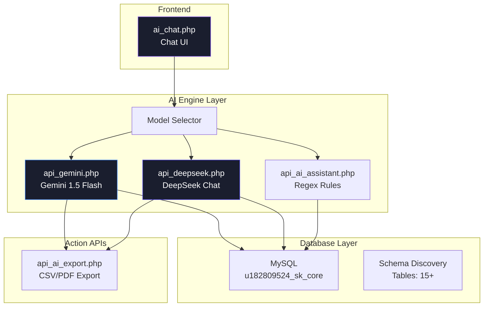
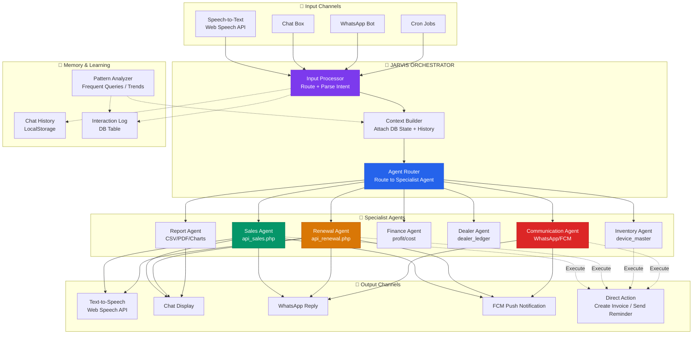
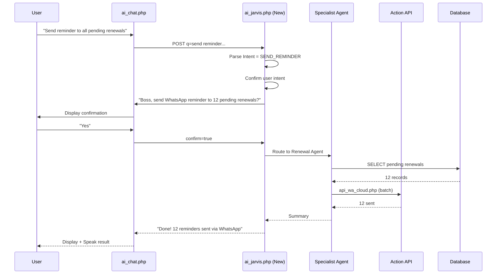
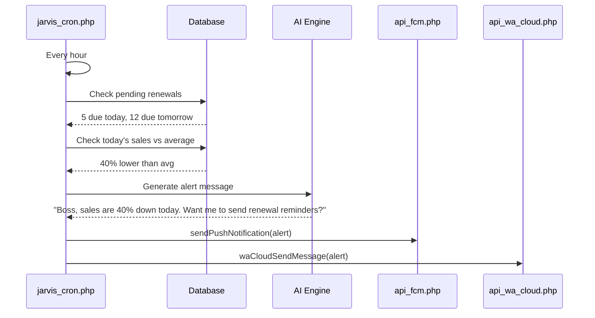

# 🧠 SK JARVIS — Business AI Assistant Architecture

> **Goal**: Transform the existing SK AI chat system into a full-featured "Jarvis-like" business assistant with voice, proactive alerts, action execution, multi-channel access, and learning capabilities.

---

## 1. Current Architecture (As-Is)



### Current Capabilities
| Capability | Status | Details |
|------------|--------|---------|
| Text Chat | ✅ Working | Tanglish support, typing effect, history persistence |
| AI LLM Integration | ✅ Working | Gemini 1.5 Flash + DeepSeek Chat (dual-model) |
| DB Schema Discovery | ✅ Working | Auto-discovers tables, columns, text/date fields |
| Natural Language SQL | ✅ Working | LLM generates SELECT queries from user questions |
| Cross-Branch Search | ✅ Working | Searches ERD + SLM databases |
| Entity Recognition | ✅ Working | Vehicle no, IMEI, mobile, dealer name |
| Business Summaries | ✅ Working | Sales, profit, stock, renewals, dealers |
| Report Export | ✅ Working | CSV/PDF for sales, renewals, stock, dealers, profit |
| Model Selection | ✅ Working | Gemini <-> DeepSeek toggle |

### Current Gaps vs Jarvis
| Missing Feature | Impact |
|----------------|--------|
| ❌ Voice Output (TTS) | Cannot speak responses |
| ❌ Voice Input (STT) | Mic button exists but not wired |
| ❌ Action Execution | Cannot create invoices, send WhatsApp, etc. |
| ❌ Proactive Alerts | Only responds, never initiates |
| ❌ WhatsApp/Telegram Bot | No multi-channel access |
| ❌ Learning/Memory | No pattern learning or predictions |
| ❌ Charts/Visuals | Text-only responses, no graphs |
| ❌ Multi-Agent System | Single monolithic prompt |

---

## 2. Proposed Architecture (To-Be: SK JARVIS)



---

## 3. Implementation Phases

### Phase 1: Voice + Quick Wins (1-2 Days)

**Goal**: Make the existing chat feel like a true assistant with voice I/O.

#### 1A. Voice Output (Text-to-Speech)
- **File**: [`ai_chat.php`](../ai_chat.php)
- **What**: After AI response, use `speechSynthesis` API to speak it
- **How**: Add a speaker toggle button + auto-speak option
- **API**: `window.speechSynthesis.speak(new SpeechSynthesisUtterance(text))`
- **Dependency**: None (native browser API)

#### 1B. Voice Input (Speech-to-Text)
- **File**: [`ai_chat.php`](../ai_chat.php)
- **What**: Wire the existing mic button to Web Speech Recognition API
- **How**: On mic click → `webkitSpeechRecognition` → fill input field
- **API**: `new webkitSpeechRecognition()` - Tamil language support available
- **Dependency**: None (native browser API)

#### 1C. Action Executor API (New File)
- **File**: [`api_jarvis_action.php`](../api_jarvis_action.php) (new)
- **What**: AI can call this to execute actions (create invoice, send WhatsApp, etc.)
- **Endpoints**:
  - `action=send_whatsapp` → calls [`api_wa_cloud.php`](../api_wa_cloud.php)
  - `action=create_renewal_invoice` → calls [`api_renewal_invoice.php`](../api_renewal_invoice.php)
  - `action=check_renewals` → calls [`api_renewal_automation.php`](../api_renewal_automation.php)
  - `action=send_push` → calls [`api_fcm.php`](../api_fcm.php)
  - `action=open_page` → returns redirect URL to open in new tab
- **Security**: All actions require confirmation "Boss, do you want me to...?"

### Phase 2: Proactive Intelligence (3-4 Days)

**Goal**: AI initiates conversations, not just responds.

#### 2A. Scheduled Intelligence Engine
- **File**: [`jarvis_cron.php`](../jarvis_cron.php) (new)
- **Schedule**: Run via Hostinger cron every hour
- **Logic**:
  ```php
  // Every morning 8 AM - send daily briefing
  // Every hour - check for anomalies
  // Every 30 min - check pending renewals approaching due
  ```
- **Integrations**:
  - [`api_renewal_automation.php`](../api_renewal_automation.php) - due renewals
  - [`api_fcm.php`](../api_fcm.php) - push notifications
  - [`api_wa_cloud.php`](../api_wa_cloud.php) - WhatsApp alerts
  - [`send_daily_reminders.php`](../send_daily_reminders.php) - existing reminder system

#### 2B. Proactive Dashboard Messages
- **File**: [`ai_chat.php`](../ai_chat.php) - modified
- **What**: Show greeting with today's stats on page load
- **What**: Auto-suggest what to check based on time of day
  - Morning: "Good boss! 5 renewals due today. Check?"
  - Afternoon: "Sales looking slow today. Want me to send reminders?"
  - Evening: "Day summary ready. Today's collection: ₹45,000"

#### 2C. Anomaly Detection
- **File**: [`api_jarvis_analytics.php`](../api_jarvis_analytics.php) (new)
- **What**: Compare today's metrics with historical averages
- **Alerts**:
  - "Sales are 40% lower than this time last week"
  - "5 devices have been in stock for 60+ days"
  - "Renewal payment rate dropped to 60% this month"

### Phase 3: Multi-Channel Access (2-3 Days)

**Goal**: Access Jarvis from WhatsApp, Telegram, or wherever you are.

#### 3A. WhatsApp Bot
- **File**: [`api_wa_cloud.php`](../api_wa_cloud.php) - enhanced
- **What**: Incoming WhatsApp messages → AI processes → replies via WhatsApp
- **Flow**:
  ```
  User WhatsApp msg → Meta Webhook → api_wa_cloud.php (incoming) 
  → call api_gemini.php or api_deepseek.php → reply via WhatsApp
  ```
- **Already exists**: [`api_wa_cloud.php`](../api_wa_cloud.php) has `waCloudSendMessage()`
- **Already exists**: [`meta_webhook.php`](../meta_webhook.php) for incoming webhooks

#### 3B. Push Notification Reminders
- **File**: [`jarvis_cron.php`](../jarvis_cron.php) - enhanced
- **What**: Send smart push notifications via FCM
- **Examples**:
  - "🔔 3 renewals expiring tomorrow"
  - "📈 Today's collection: ₹32,000 (up 15% from yesterday)"
  - "⚠️ Dealer X hasn't paid for 5 devices"
- **Already exists**: [`api_fcm.php`](../api_fcm.php) has `sendPushNotification()`

### Phase 4: Advanced Jarvis Features (4-5 Days)

**Goal**: True autonomous assistant with agents and memory.

#### 4A. Specialist Agent System
- **File**: [`api_jarvis_orchestrator.php`](../api_jarvis_orchestrator.php) (new)
- **What**: Parse query → route to specialist agent → compile response
- **Agent Definitions**:

| Agent | Expertise | API Integration |
|-------|-----------|-----------------|
| **Sales Agent** | Invoices, collections, profit trends | [`api_sales.php`](../api_sales.php), [`sales_invoice.php`](../sales_invoice.php) |
| **Renewal Agent** | Due dates, pending payments, status | [`api_renewal.php`](../api_renewal.php), [`api_renewal_automation.php`](../api_renewal_automation.php) |
| **Inventory Agent** | Stock levels, device location, IMEI | [`device_master`](../device_master.php), [`stock_transfer.php`](../stock_transfer.php) |
| **Dealer Agent** | Dealer ledger, pending amounts, history | [`api_dealers.php`](../api_dealers.php), [`dealer_ledger`](../dealer_manager.php) |
| **Finance Agent** | Profit/loss, expenses, cash flow | [`expense_manager.php`](../expense_manager.php), [`fin_assets.php`](../fin_assets.php) |
| **Communication Agent** | WhatsApp, SMS, push notifications | [`api_wa_cloud.php`](../api_wa_cloud.php), [`api_fcm.php`](../api_fcm.php) |
| **Report Agent** | Charts, exports, summaries | [`api_reports.php`](../api_reports.php), [`api_ai_export.php`](../api_ai_export.php) |

#### 4B. Memory & Learning Layer
- **File**: [`jarvis_memory.php`](../jarvis_memory.php) (new)
- **Database Table**: `jarvis_interactions`
  - `id`, `user_query`, `ai_response`, `agent_used`, `action_taken`, `timestamp`, `user_feedback`
- **What it enables**:
  - "You always check renewals at 10am. Today's list is ready."
  - "Last time you asked about Dealer X, you also checked their pending payment."
  - "Your most searched term this month: 'pending renewals' (47 times)"

#### 4C. Visual Response Engine
- **File**: [`ai_chat.php`](../ai_chat.php) - modified
- **What**: Render charts, tables, and mini-dashboards inline
- **Examples**:
  - "Show sales trend" → inline Chart.js mini chart
  - "Compare this month vs last month" → bar chart
  - "Show top dealers" → horizontal bar chart
- **Already exists**: Chart.js loaded in [`index.html`](../index.html:11)

### Phase 5: Polish & Production (2-3 Days)

**Goal**: Rock-solid, fast, and delightful.

#### 5A. Performance Optimization
- Cache schema discovery results (currently queries every time)
- Cache common queries (today's sales, stock count)
- Lazy-load AI model (don't initialize until first query)

#### 5B. Error Handling & Fallbacks
- If Gemini fails → auto-fallback to DeepSeek
- If DeepSeek fails → auto-fallback to rule-based [`api_ai_assistant.php`](../api_ai_assistant.php)
- If all AI fails → show "Boss, network issue. Local data available."

#### 5C. User Preferences
- Model preference (saved)
- Voice on/off
- Language preference (Tanglish / English / Tamil)
- Proactive alert frequency
- Theme (already exists in [`theme_engine.js`](../theme_engine.js))

#### 5D. Feedback & Learning
- Thumbs up/down on AI responses
- Store feedback in DB for future fine-tuning
- Track which agent types are most used

---

## 4. Data Flow Diagrams

### Query Flow (User → Jarvis → Action)



### Cron Flow (Proactive Alert)



---

## 5. File Map

### New Files to Create

| File | Purpose | Phase |
|------|---------|-------|
| [`api_jarvis_orchestrator.php`](../api_jarvis_orchestrator.php) | Central AI router, intent parser, agent dispatcher | Phase 4 |
| [`api_jarvis_action.php`](../api_jarvis_action.php) | Execute business actions (create invoice, send msg) | Phase 1 |
| [`api_jarvis_analytics.php`](../api_jarvis_analytics.php) | Anomaly detection, trend analysis | Phase 2 |
| [`jarvis_cron.php`](../jarvis_cron.php) | Scheduled proactive checks & alerts | Phase 2 |
| [`jarvis_memory.php`](../jarvis_memory.php) | Store/retrieve interaction history | Phase 4 |

### Existing Files to Modify

| File | Changes | Phase |
|------|---------|-------|
| [`ai_chat.php`](../ai_chat.php) | Voice I/O, proactive greeting, charts, visual responses | Phase 1, 4 |
| [`api_gemini.php`](../api_gemini.php) | Return action intents alongside text response | Phase 1 |
| [`api_deepseek.php`](../api_deepseek.php) | Return action intents alongside text response | Phase 1 |
| [`api_wa_cloud.php`](../api_wa_cloud.php) | Handle incoming messages → route to Jarvis | Phase 3 |
| [`meta_webhook.php`](../meta_webhook.php) | Forward webhook messages to Jarvis | Phase 3 |

---

## 6. Key Design Decisions

### A. Progressive Enhancement
The system should work **even without AI API keys**. If Gemini/DeepSeek keys are missing, fall back to:
1. Local regex engine ([`api_ai_assistant.php`](../api_ai_assistant.php) style)
2. Direct database queries
3. Static business summaries

### B. Confirmation-First Actions
Jarvis should **never execute destructive actions without confirmation**.
```
User: "Delete all pending renewals"
Jarvis: "Boss, that will delete 15 records. Are you sure? [Yes] [No]"
```

### C. Tanglish-First, English-Fallback
All responses default to Tanglish (Tamil + English mix), with option to switch to full English.

### D. Stateless Agent Design
Each specialist agent is a pure function: input → process → output. No shared state between agents. State is stored in the database (interactions table).

---

## 7. Technology Stack (No New Dependencies)

| Technology | Purpose | Already In Use? |
|------------|---------|-----------------|
| PHP 8.x | Backend APIs | ✅ [`index.html`](../index.html) |
| MySQL | Database | ✅ `db_connect.php` |
| Vanilla JS + CSS | Frontend | ✅ [`ai_chat.php`](../ai_chat.php) |
| Chart.js | Data visualization | ✅ [`index.html`](../index.html:11) |
| Web Speech API | Voice I/O | ❌ New (native, no install) |
| Firebase Cloud Messaging | Push notifications | ✅ [`api_fcm.php`](../api_fcm.php) |
| Meta WhatsApp Cloud API | WhatsApp | ✅ [`api_wa_cloud.php`](../api_wa_cloud.php) |
| Gemini API | LLM | ✅ [`api_gemini.php`](../api_gemini.php) |
| DeepSeek API | LLM | ✅ [`api_deepseek.php`](../api_deepseek.php) |
| Font Awesome | Icons | ✅ [`ai_chat.php`](../ai_chat.php:12) |

**Zero new dependencies**. Everything uses existing libraries and browser-native APIs.

---

## 8. Security Considerations

1. **Action Confirmation**: All write operations require explicit user confirmation
2. **SQL Injection Protection**: Already handled via PDO prepared statements
3. **API Key Security**: Keys stored in config files (not in code) - already done
4. **Rate Limiting**: Max 30 AI queries per minute to prevent API cost spikes
5. **Audit Log**: All actions executed by Jarvis logged to `jarvis_action_log` table
6. **Firebase Auth**: Protected pages already use Firebase Auth ([`index.html`](../index.html:17))

---

## 9. Success Metrics

| Metric | Current | Target |
|--------|---------|--------|
| Query Response Time | ~3-5 sec | < 2 sec (cache common queries) |
| Voice Support | None | TTS + STT working |
| Action Execution | None | 5+ action types |
| Proactive Alerts | None | Hourly smart alerts |
| WhatsApp Access | Manual send only | Full conversational bot |
| User Retention | Unknown | Track daily active users |

---

## 10. Summary

This transforms your existing 40% Jarvis into a **90% Jarvis** by adding:

```
Current:  Ask → AI thinks → AI speaks (text)
Jarvis:   Ask/Speak/WhatsApp → AI thinks + checks DB → 
          AI speaks + shows charts + executes actions + 
          sends WhatsApp + sends push notifications
```

The architecture is designed for **progressive implementation** — you can stop at any phase and have a working, useful system.
